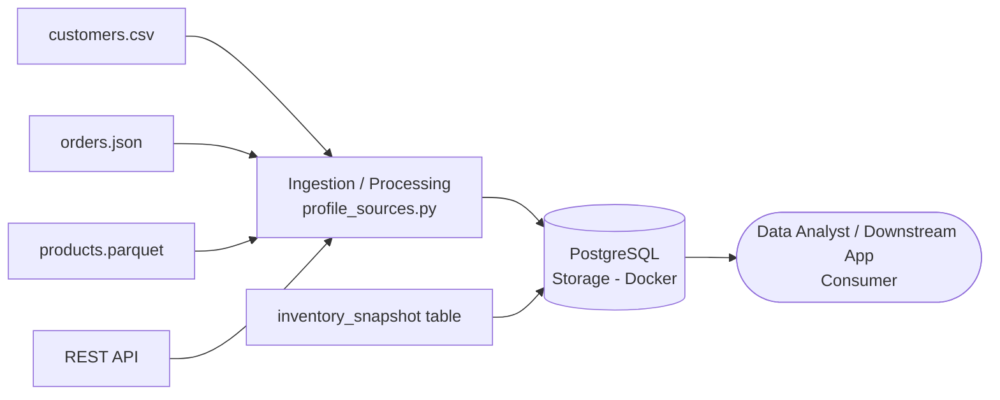

# Data Engineering Lifecycle Map

| Lifecycle Element | What It Means | Example in This Lab | Primary Tool/Artifact | Possible Failure |
|---|---|---|---|---|
| Source system | The origin system that produces or holds raw data before it enters a pipeline | customers.csv, orders.json, products.parquet, the REST API, the PostgreSQL table | data/raw/ files, API endpoint, inventory_snapshot table | Source changes format or goes offline without notice |
| Ingestion/acquisition | The process of pulling data from a source system into the pipeline environment | Downloading customers.csv/orders.json/products.parquet into data/raw/, calling the REST API and saving api_snapshot.json, querying the PostgreSQL table | requests library, pandas readers, src/inspect_api.py | API times out, file is corrupted during download, or the file format changes unexpectedly |
| Storage | Where acquired data is kept, either temporarily as raw files or persistently in a database | Raw files sitting in data/raw/, and the Dockerized PostgreSQL database holding structured tables | Docker volume dss150p_pgdata, data/raw/ folder | Container data is lost if the volume is deleted, or disk space runs out |
| Processing/transformation | Reading, cleaning, and computing statistics or structure from the raw data | Profiling each file's shape, dtypes, nulls, and duplicates without altering the original files | src/profile_sources.py | Incorrect type inference or silent parsing errors change the meaning of the data |
| Data quality/validation | Checking that data meets expected structure, completeness, and business rules | Counting nulls, duplicate rows, and distinct values per column; defining CHECK constraints and NOT NULL rules in the schema | src/profile_sources.py, sql/01_create_schema.sql | Bad data passes undetected because a rule was never defined or tested |
| Delivery | Making validated data available in a structured, queryable form for downstream use | Creating a formal table (lab.customers or lab.orders) in PostgreSQL based on the profiled schema | sql/01_create_schema.sql | Schema drifts from the actual source, causing load failures or type mismatches |
| Consumer | The person, team, or application that ultimately uses the delivered data | A data analyst or future pipeline querying the PostgreSQL table to build reports or models | PostgreSQL client / SQL queries | Consumer misinterprets a field because it wasn't documented, or accesses stale data |

## Lifecycle Diagram

